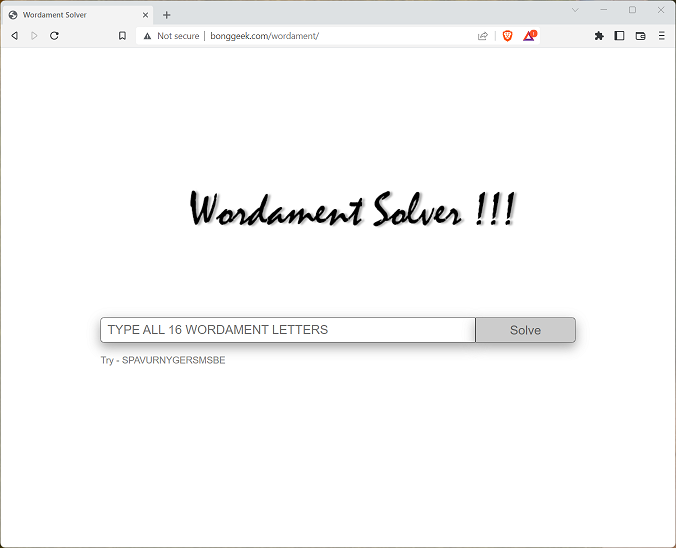
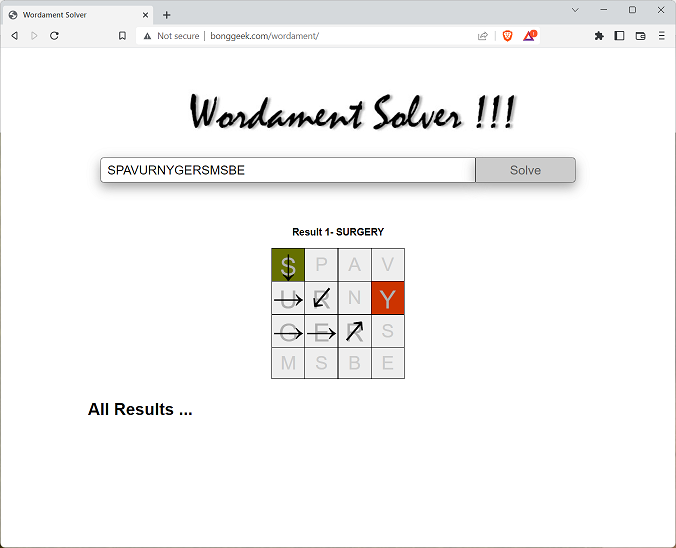

# Wordament Solver

This tool is a solver for the popular game wordament. It contains go code for a [solver](./solver) that exposes an API and is designed 
to be run in a linux container. There is a [wordament-cli](./wordament-cli) command line version for local testing. Also code for the
single page app that works off of the API  is in [web](./web).

Wordament is a game where player gets a N x N Matrix and needs to find words by swipping through the matrix.
This implementation only supports 4x4 matrix and only english alphabets.

The application is currently hosted at http://bonggeek.com/wordament. 



In the text box simply enter all the 16 characters of the wordament. So for

```
S P A V 
U R N Y
G E R S
M S B E
```
Enter SPAVURNYGERSMSBE and hit enter. The solution is presented overlaid on the matrix. A valid word (e.g. Surgery) can be 
found by swiping starting at the green cell and following the arrows till the Red cell.



Tapping/clicking on the image or using the arrow ← → keys, you can move to the next solution. The solutions are sorted
from longers to shortest words, and duplicates (same word that can be found using different set of cells) are 
excluded. Tapping/clicking the All Results, shows all the results in sequence.

Pre-Req
========
To build the code the pre-reqs are as below.
1. Go 1.18 (with generics needed). Otherwise tests don't work
2. Docker installed
3. Local dev/test works on Windows 
4. A linux or WSL 2 setup is required for running inside container, publishing

Local Build Test
================
Local Build using the following in either the [wordament-cli](./wordament-cli) or [service](./service) folder
``` bash
go build .
```

Local Run using direct console app
``` bash
wordament-cli ZRFLPFUALINXAYEM
```

To test the service run
``` bash
service -port=80
```

From another console run
``` bash
curl localhost/?input=SPAVURNYGERSMSBE -v
```

To run the tests, run following from [test](./test)
``` bash
go test ./… -v
```

Web-Service
============
Build
------
This needs to be run inside a linux environment, my tool of choice is WSL 2

Get into WSL 2 on Windows machine. Ensure the pre-reqs mentioned above is present

``` bash
cd ~/github/wordament/service
./build.sh
docker push bonggeek/wordament
```

Deploy to VM
------------
SSH into your Linux VM
``` bash
ssh <user>@server -i MyKey.cer
```

Then either run the deployment script
``` bash
sudo bash
curl -fsSL "https://raw.githubusercontent.com/abhinababasu/wordament/main/service/deploy.sh?token=GHSAT0AAAAAAB26S7FFQJA7APXSWXXJW7U6Y32Y2SA" | bash
```

Or manually
``` bash
docker ps --filter="ancestor=bonggeek/wordament" -q | xargs docker stop
docker pull bonggeek/wordament
docker run -d --restart="always" -p 8090:8090 bonggeek/wordament
```

Test Remote
------------
Run Against Remote
``` bash
curl commonvm1.westus2.cloudapp.azure.com:8090/?input=SPAVURNYGERSMSBE
```

Misc
=====
While there is many more optimization that can be done, at this point the service meets my basic requirement. On a 2 vCPU Azure VM, the service loads the dictionaries in <100ms and solves a wordament game in ~1ms 

TODOs / Known Issues
====================
1. No multiple letter cell support
1. Word found is as good as the word list I have (which is not very good)
